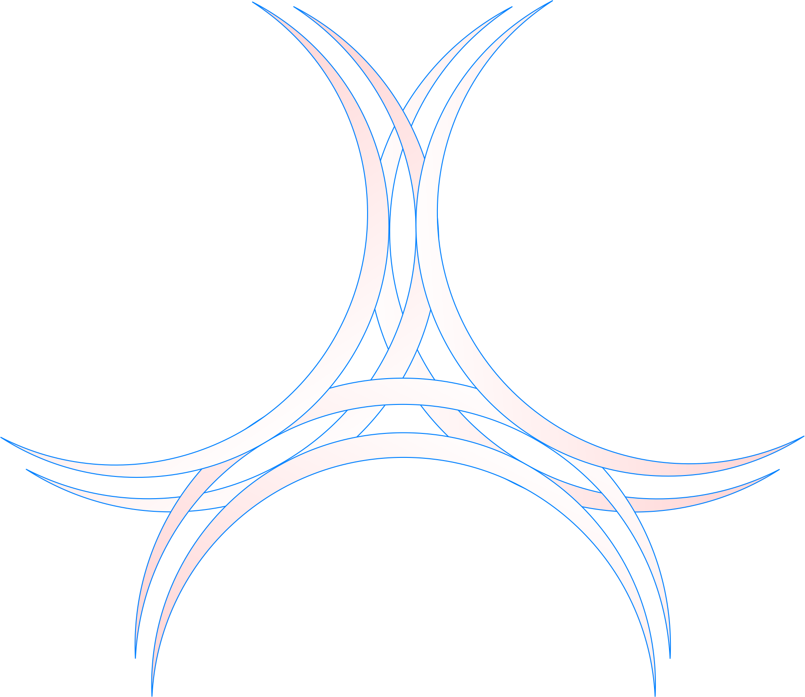

  

  <a href="https://github.com/maleenrox">
    <!-- Using the exact image you provided. Just ensure image_769a19.png is uploaded to the root of your repository -->
    
  </a>

 

  

 

<!-- SOCIAL && REPO BADGES -->

  
  
  
    
  
  
  

---

<!-- TERMINAL-STYLE ABOUT ME -->
<h2 align="center">🖥️ About Me</h2>

  

---

<!-- TECH STACK SECTION -->
<h2 align="center">💻 Tech Stack & Arsenal</h2>

  
<b>Languages & Scripting</b>

  
    

  
<b>Frontend & UI</b>

  
    
  
  
<b>Cybersecurity, DevOps & Environments</b>

  
    
  
  
<b>Backend & Databases</b>

  

 
  
  
<b>Specialized Other Tech, Frameworks & Legacy</b>

  

    
    
    
    
    
    
    
  

---

<!-- LIVE METRICS DASHBOARD -->
<h2 align="center">📊 Telemetry & Metrics</h2>

  <table width="100%" border="0" cellspacing="0" cellpadding="0">
    <tr>
      <td width="50%" align="center" valign="top">
        
      </td>
      <td width="50%" align="center" valign="top">
        
      </td>
    </tr>
    <tr>
      <td width="50%" align="center" valign="top">
        
      </td>
      <td width="50%" align="center" valign="top">
        <!-- Replaced the pinned repo with your actual project name -->
        
      </td>
    </tr>
  </table>

 

  

 

<!-- COOL ANIMATION ADDITION: GITHUB SNAKE -->
<h2 align="center">🐍 Contribution Grid Snake</h2>

  
<i>A snake consuming my contributions to generate a dynamic cyber-grid!</i>

  <!-- Note: To make this snake work natively on your profile, you will need to set up a GitHub Action. Standard placeholder used here. -->
  <picture>
    <source media="(prefers-color-scheme: dark)" srcset="https://raw.githubusercontent.com/maleenrox/maleenrox/output/github-contribution-grid-snake-dark.svg">
    <source media="(prefers-color-scheme: light)" srcset="https://raw.githubusercontent.com/maleenrox/maleenrox/output/github-contribution-grid-snake.svg">
    
  </picture>

 

  

